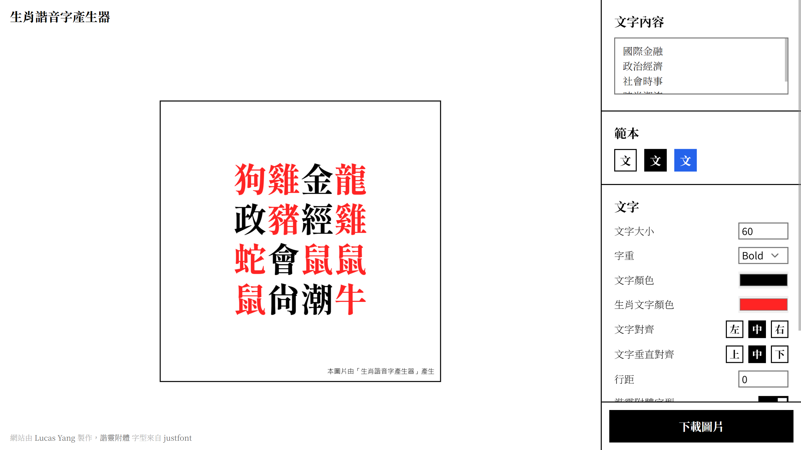

<h1 align="center">生肖諧音字產生器</h1>



<p align="center"><strong>一起來產生生肖諧音字~</strong></p>

---

使用 [Vue.js](https://vuejs.org/) 和 [Phaser](https://phaser.io/) 製作的生肖諧音字產生器網站。

## 安裝

```bash
yarn
yarn dev
```

## 銘謝

* 感謝由 [justfont](https://justfont.com/) 製作的 [諧靈附體字體](https://github.com/justfont/AllPunType)
